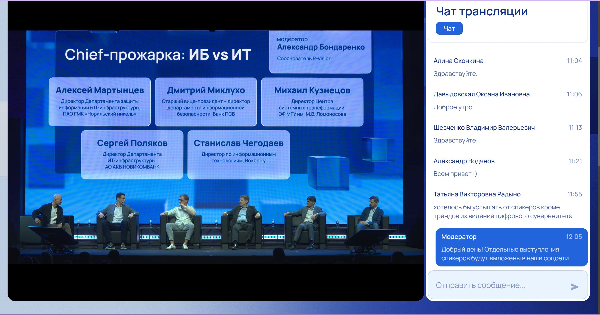
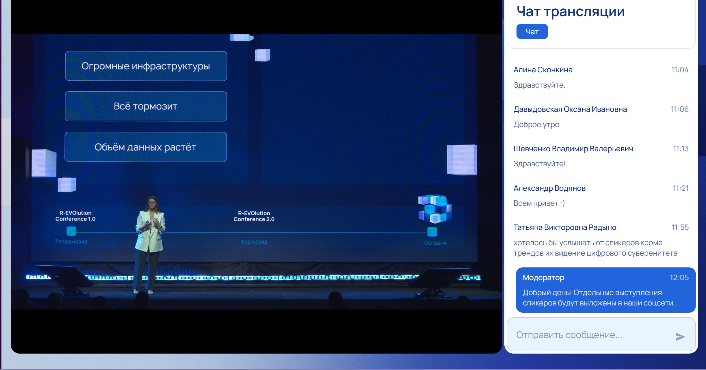
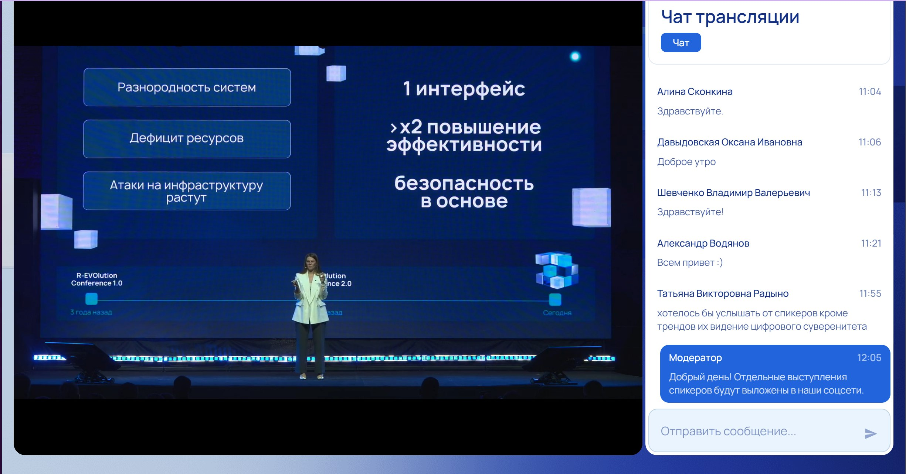
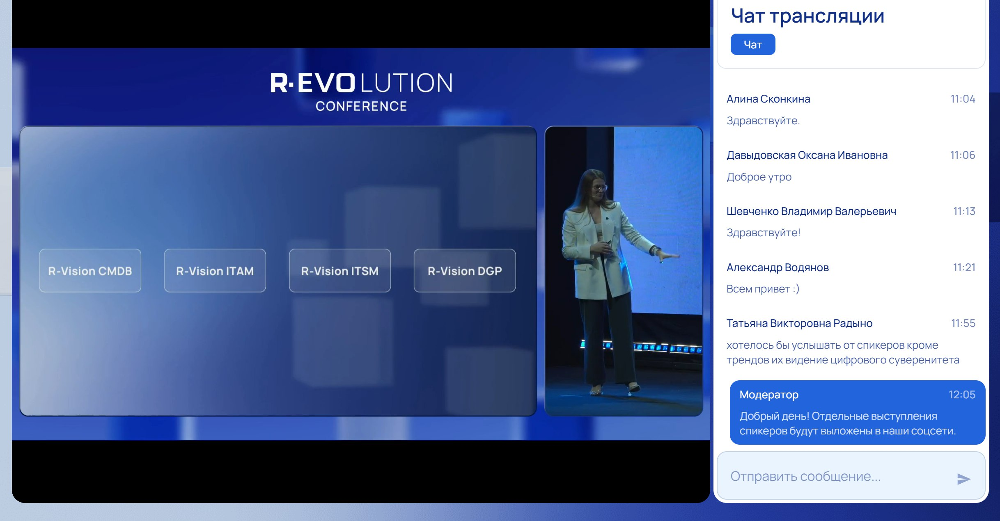
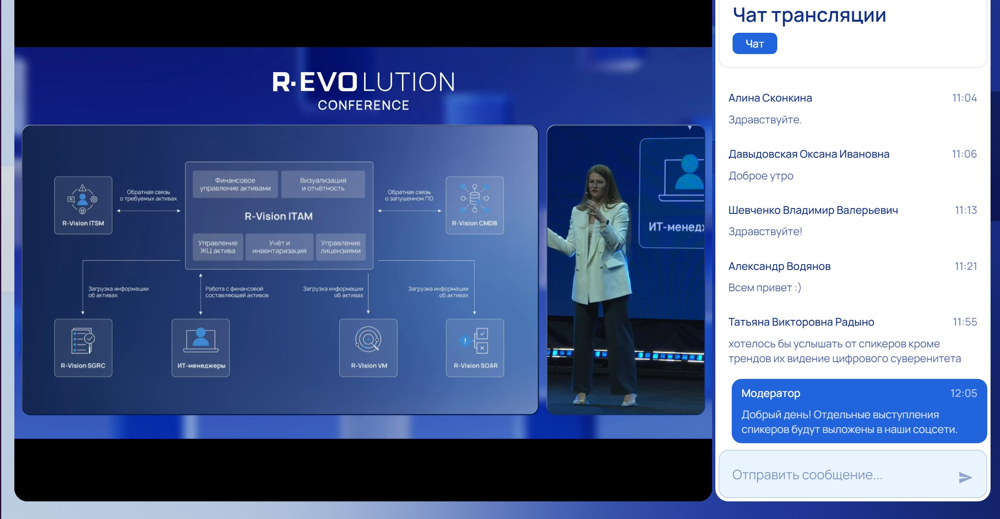

# Отчет о посещении конференции R-EVOlution Conference 2025

## Дата проведения: 23 апреля 2025

## Общая информация

В рамках учебной практики было посещено мероприятие R-EVOlution Conference 2025, организованное компанией R-Vision. Тематика конференции была сосредоточена на новых подходах к автоматизации процессов информационной безопасности, интеграции ИТ и ИБ, а также разборе практических кейсов из реальной корпоративной и финансовой среды.

Участие в конференции позволило получить представление о современных инструментах в области кибербезопасности и о том, как они внедряются и используются в крупных организациях.

## О компании R-Vision

R-Vision — российский разработчик программных решений в области информационной безопасности и цифровизации. Основные направления деятельности:

-   Платформы SOAR, SIEM
    
-   Управление ИТ-активами и конфигурациями (ITAM, CMDB)
    
-   ITSM и системы управления инцидентами
    

Решения R-Vision используются в госсекторе, банковской сфере, промышленности и других отраслях.

## Основные спикеры и темы выступлений

На конференции выступили следующие специалисты:

-   Дарья Петрова — директор по продуктам R-Vision
    
-   Виктор Никуличев — менеджер продукта R-Vision SIEM
    
-   Сафрон Дандаев — директор по развитию сервисов кибербезопасности банка ПСБ
    
-   Марат Шамсутдинов — начальник отдела ИБ, СберАналитика
    

## Платформа EVO от R-Vision

Дарья Петрова представила новую экосистему EVO, разработанную для объединения ИТ и ИБ в рамках единой платформы. EVO включает в себя:

-   CMDB — централизованный учет и визуализация ИТ-активов
    
-   ITAM — управление жизненным циклом и лицензиями
    
-   ITSM — согласование процессов между ИТ и ИБ
    
-   DGP — платформа управления качеством и безопасностью данных
    

Платформа позволяет устранить дублирование, упростить процессы и масштабировать инфраструктуру под потребности бизнеса.

## Практический опыт внедрения SOAR

Доклад Сафрона Дандаева касался практического применения SOAR в банке ПСБ. Основные цели внедрения:

-   Автоматизация рутинных операций SOC
    
-   Снижение времени реагирования
    
-   Централизация обработки событий
    

Примеры автоматизированных сценариев:

-   Обработка подозрительных писем
    
-   Контроль использования съемных носителей
  

## Этапы и рекомендации по внедрению SOAR

Марат Шамсутдинов представил подход к внедрению и эксплуатации SOAR, начиная с простых сценариев (регистрация и уведомление) и поэтапным расширением до сложной автоматизации.

Ключевые акценты:

-   Постепенность внедрения
    
-   Создание базы знаний
    
-   Оценка метрик эффективности (время реакции, количество инцидентов)
    

SOAR повышает прозрачность работы SOC и позволяет обосновывать инвестиции в ИБ через реальные показатели.

## Выводы

Участие в конференции позволило:

-   Получить актуальные знания по архитектуре и интеграции систем ИТ и ИБ
    
-   Познакомиться с реальными кейсами автоматизации SOC
    
-   Понять особенности внедрения платформенного подхода на базе решений R-Vision
    

Полученная информация будет полезна при дальнейшем изучении и реализации проектов в области информационной безопасности, особенно в части автоматизации процессов реагирования и построения интегрированных систем управления.
