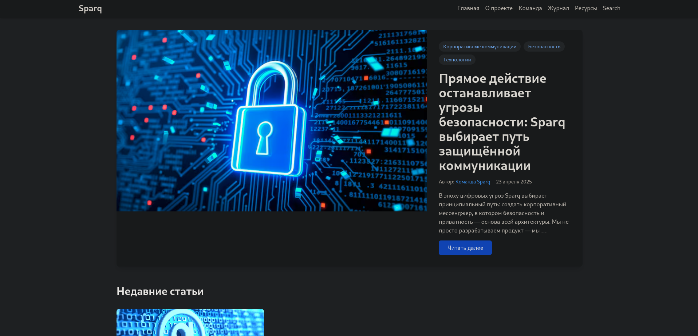

# Корпоративный мессенджер - Sparq 



Современная, адаптивная тема для Hugo, разработанная для корпоративных сайтов и презентационных платформ. Построена с использованием Tailwind CSS и Alpine.js.

Проекта на Hugo, размещённого на GitHub Pages ([https://donstoun.github.io/practice-2025-Nuryyev/](https://donstoun.github.io/practice-2025-Nuryyev/)).

  

## Особенности

-   🎨 Современный дизайн с Tailwind CSS
    
-   🔍 Встроенная функция поиска
    
-   📱 Полностью адаптивный интерфейс
    
-   🏷️ Поддержка категорий, тегов и участников
    
-   🖼️ Выделенные статьи с крупными изображениями
    
-   🔄 Динамическая навигация по категориям
    
-   👥 Список команд
    
-   🔍 Поиск с использованием Fuse.js
    
-   ⚡ Быстрая загрузка с минимальным JavaScript
    
-   🎨 Чистая типографика и сбалансированные отступы
    
-   📊 Интеграция с Google Analytics 4
    

## Установка

1.  В директории вашего сайта Hugo выполните:
    

bash

CollapseCopy

```bash
git submodule add https://github.com/donstoun/practice-2025-Nuryyev themes/corporate-site
```

2.  Обновите конфигурацию в hugo.toml:
    

toml

CollapseCopy

```toml
theme = "corporate-site"
```

## Конфигурация

### Google Analytics

Тема поддерживает Google Analytics 4 (GA4). Для активации:

1.  Получите Measurement ID из вашего аккаунта Google Analytics (формат: G-XXXXXXXXXX).
    
2.  Добавьте его в конфигурационный файл сайта:
    

toml

CollapseCopy

```toml
googleAnalytics = "G-XXXXXXXXXX"  # Замените на ваш Measurement ID
```

Код аналитики:

-   Загружается только при наличии действительного Measurement ID
    
-   Учитывает настройки конфиденциальности и согласия на cookies
    
-   Загружается асинхронно, не влияя на производительность
    
-   Отслеживает просмотры страниц и базовые взаимодействия
    

Если аналитика не нужна, закомментируйте параметр:

toml

CollapseCopy

```toml
# googleAnalytics = "G-MEASUREMENT_ID"
```

### Базовая конфигурация

Пример конфигурации hugo.toml:

toml

CollapseCopy

```toml
baseURL = 'https://donstoun.github.io/practice-2025-Nuryyev/'
languageCode = 'ru-RU'
title = 'Корпоративный Сайт'

[taxonomies]
  category = "categories"
  tag = "tags"
  participant = "participants"

[outputs]
  home = ["HTML", "RSS", "JSON"]

[[menus.main]]
name = "Главная"
url = "/"
weight = 10

[[menus.main]]
name = "О проекте"
url = "/about"
weight = 20

[[menus.main]]
name = "Журнал"
url = "/journal"
weight = 30

[[menus.main]]
name = "Ресурсы"
url = "/resources"
weight = 40
```

## Структура контента

plain

CollapseCopy

```
content/
├── _index.md
├── journal/
│   ├── index.md
├── articles/
│   ├── _index.md
│   └── first-article/
│       ├── _index.md
│       └── first.jpg
│   └── second-article/
│       ├── _index.md
│       └── second.jpg
├── about/
│   └── _index.md
└── resources/
    └── _index.md
```

### Front Matter для статьи

yaml

CollapseCopy

```yaml
---
title: "Название статьи"
date: 2025-04-01
participant: "Имя участника"
categories: ["Категория1", "Категория2"]
tags: ["тег1", "тег2"]
featured_image: "path/to/image.jpg"
description: "Описание статьи"
---
```

### Front Matter для участника

yaml

CollapseCopy

```yaml
---
title: "Имя Участника"
bio: "Биография участника"
avatar: "participant-image.jpg"
social:
  github: "githubhandle"
  linkedin: "linkedinprofile"
---
```

## Система комментариев

Тема поддерживает два типа комментариев:

### Статические комментарии

Статические комментарии хранятся в файле comments.json рядом с контентом статьи. Они видны всем пользователям и сохраняются между сеансами. Для добавления:

1.  Создайте файл comments.json в директории статьи.
    
2.  Используйте следующую структуру:
    

json

CollapseCopy

```json
{
  "comments": [
    {
      "name": "Имя автора",
      "content": "Текст комментария",
      "date": "2025-04-25T15:30:00Z",
      "isStatic": true
    }
  ]
}
```

Пример структуры директории:

plain

CollapseCopy

```
content/
└── journal/
    └── my-post/
        ├── index.md
        ├── featured-image.jpg
        └── comments.json
```

### Динамические комментарии

Динамические комментарии сохраняются в localStorage браузера пользователя. Они:

-   Видны только автору комментария
    
-   Сохраняются при обновлении страницы в том же браузере
    
-   Не передаются другим пользователям
    
-   Удаляются при очистке данных браузера
    

Динамические комментарии обрабатываются JavaScript темой автоматически.

## Разработка

Требования:

-   Hugo Extended Version (>= 0.116.0)
    
-   Node.js (для разработки с Tailwind CSS)
    

## Вклад в проект

1.  Сделайте форк репозитория
    
2.  Создайте ветку для новой функции (git checkout -b feature/amazing-feature)
    
3.  Зафиксируйте изменения (git commit -m 'Добавлена крутая функция')
    
4.  Отправьте ветку в репозиторий (git push origin feature/amazing-feature)
    
5.  Создайте Pull Request
    

## Лицензия

Распространяется под MIT License.

## Авторы и технологии

-   Построено с использованием Tailwind CSS
    
-   Интерактивные компоненты на Alpine.js
    
-   Функция поиска с Fuse.js
